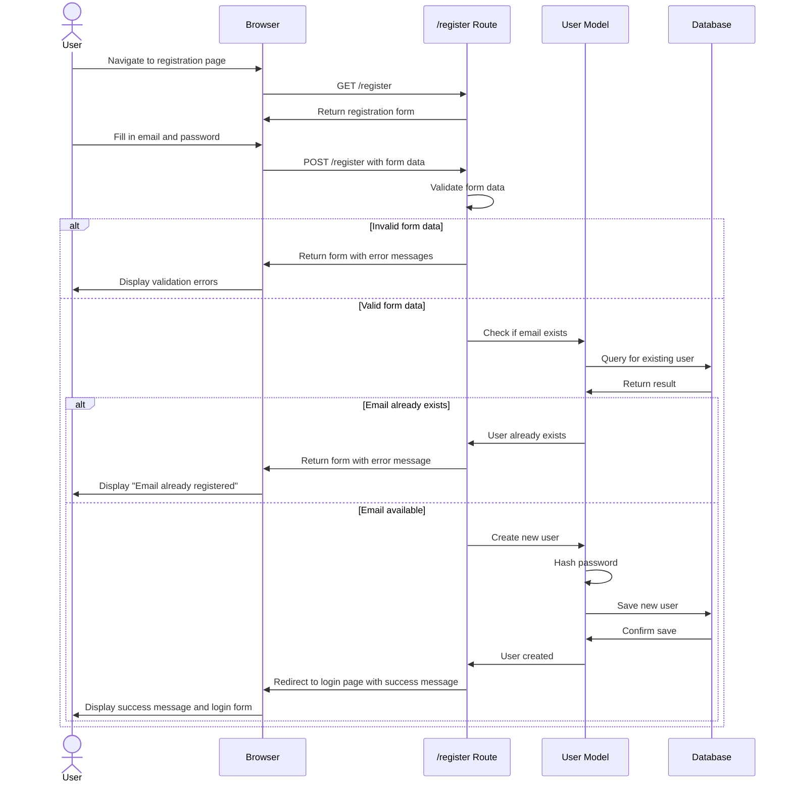
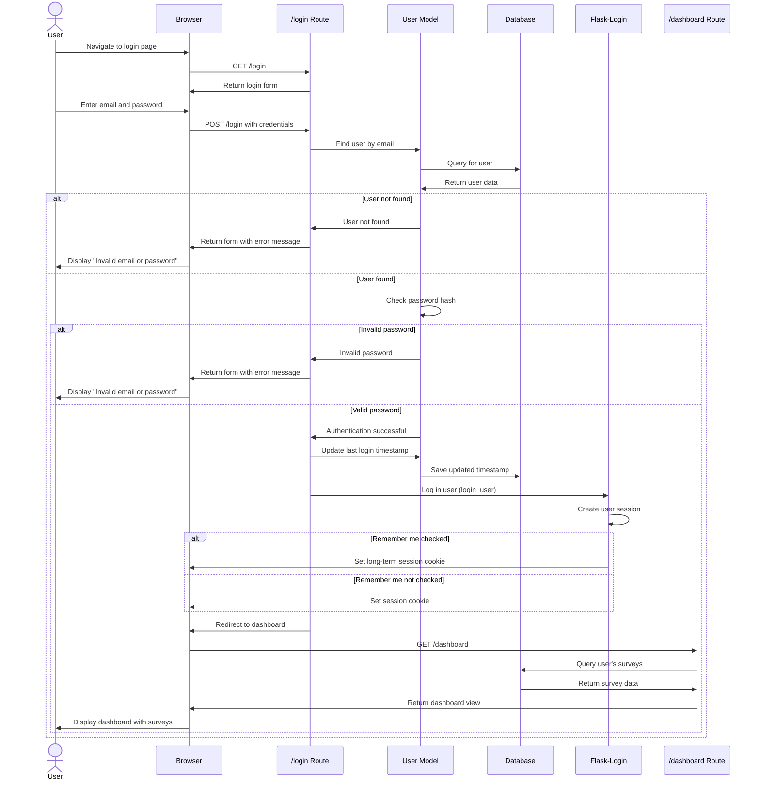

# Customer Survey Application

A simple web application for creating and managing customer surveys.

## Features

- User registration and authentication
- Create custom surveys with multiple choice options
- Share surveys via unique links
- View and analyze survey results
- Track customer feedback

## Authentication Flow Diagrams

### User Registration Process



### User Login Process



## Project Structure

```
src/
├── static/          # Static assets (CSS, JS, images)
├── models/          # Database models
├── routes/          # Route handlers
├── templates/       # HTML templates
├── extensions.py    # Flask extensions
├── app.py           # Application factory
```

## Database Schema

The application uses the following database tables:
- Users: Store user information
- Surveys: Store survey information
- Survey_Options: Store survey options
- Survey_Responses: Store survey responses

For a detailed ERD, see [data-model.md](data-model.md).

## Installation

1. Clone the repository
2. Create a virtual environment and activate it:
   ```
   python -m venv .venv
   source .venv/bin/activate  # On Windows: .venv\Scripts\activate
   ```
3. Install dependencies:
   ```
   pip install -r requirements.txt
   ```
4. Set environment variables (optional):
   ```
   export SECRET_KEY=your_secret_key
   export DATABASE_URL=sqlite:///survey_app.db
   ```

## Running the Application

### Development Mode

```
python run.py
```

The application will be available at http://127.0.0.1:5000/

### Production Mode with Gunicorn

```
gunicorn -c gunicorn_config.py wsgi:app
```

The application will be available at http://0.0.0.0:8000/

### Using Containers

#### Local Development

Build and run the container:

```
# Build the container image with a specific version
./build-container.sh 1.0.0

# Run with Finch
finch run -p 8000:8000 customer-survey-app:1.0.0
```

Or using Docker Compose:

```
finch compose up
```

#### Using Pre-built Images

Pull and run the pre-built container images from GitHub Container Registry:

```
# Pull the latest image
finch pull ghcr.io/username/customer-survey-app:latest

# Run the container
finch run -p 8000:8000 ghcr.io/username/customer-survey-app:latest
```

The application will be available at http://localhost:8000/

## CI/CD Pipeline

This project uses GitHub Actions for continuous integration and delivery:

1. **Container Builds**: Container images are built for both AMD64 and ARM64 architectures
2. **Automatic Deployment**: Tagged releases are automatically pushed to GitHub Container Registry

## Usage

1. Register a new account
2. Log in with your credentials
3. Create a new survey from the dashboard
4. Share the survey link with your customers
5. View results as responses come in

## Contributing

1. Fork the repository
2. Create a feature branch: `git checkout -b feature/my-new-feature`
3. Commit your changes: `git commit -am 'Add some feature'`
4. Push to the branch: `git push origin feature/my-new-feature`
5. Submit a pull request
