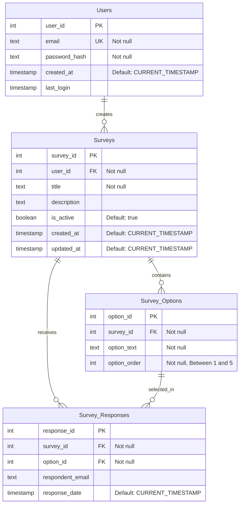

# Customer Survey Application - Data Model

## Entity-Relationship Diagram (ERD)

## Database Schema Details

### Users Table

Stores user account information for authentication and profile management.

| Column | Type | Constraints | Description |
|--------|------|-------------|-------------|
| user_id | INTEGER | PRIMARY KEY, AUTOINCREMENT | Unique identifier for each user |
| email | TEXT | UNIQUE, NOT NULL | User's email address, used for login |
| password_hash | TEXT | NOT NULL | Securely hashed password |
| created_at | TIMESTAMP | DEFAULT CURRENT_TIMESTAMP | When the user account was created |
| last_login | TIMESTAMP | | Last time the user logged in |

### Surveys Table

Stores information about surveys created by users.

| Column | Type | Constraints | Description |
|--------|------|-------------|-------------|
| survey_id | INTEGER | PRIMARY KEY, AUTOINCREMENT | Unique identifier for each survey |
| user_id | INTEGER | FOREIGN KEY, NOT NULL | References Users(user_id), CASCADE on delete |
| title | TEXT | NOT NULL | Survey title |
| description | TEXT | | Optional survey description |
| is_active | BOOLEAN | DEFAULT TRUE | Whether the survey is currently active |
| created_at | TIMESTAMP | DEFAULT CURRENT_TIMESTAMP | When the survey was created |
| updated_at | TIMESTAMP | DEFAULT CURRENT_TIMESTAMP | When the survey was last updated |

### Survey_Options Table

Stores the options available for each survey.

| Column | Type | Constraints | Description |
|--------|------|-------------|-------------|
| option_id | INTEGER | PRIMARY KEY, AUTOINCREMENT | Unique identifier for each option |
| survey_id | INTEGER | FOREIGN KEY, NOT NULL | References Surveys(survey_id), CASCADE on delete |
| option_text | TEXT | NOT NULL | Text of the survey option |
| option_order | INTEGER | NOT NULL, CHECK(option_order BETWEEN 1 AND 5) | Order of the option in the survey (1-5) |

### Survey_Responses Table

Stores responses submitted for surveys.

| Column | Type | Constraints | Description |
|--------|------|-------------|-------------|
| response_id | INTEGER | PRIMARY KEY, AUTOINCREMENT | Unique identifier for each response |
| survey_id | INTEGER | FOREIGN KEY, NOT NULL | References Surveys(survey_id), CASCADE on delete |
| option_id | INTEGER | FOREIGN KEY, NOT NULL | References Survey_Options(option_id), CASCADE on delete |
| respondent_email | TEXT | | Optional email of the respondent |
| response_date | TIMESTAMP | DEFAULT CURRENT_TIMESTAMP | When the response was submitted |

## Relationships

1. **Users to Surveys**: One-to-many relationship. A user can create multiple surveys, but each survey has exactly one creator.

2. **Surveys to Survey_Options**: One-to-many relationship. A survey can have multiple options (limited to 5), but each option belongs to exactly one survey.

3. **Surveys to Survey_Responses**: One-to-many relationship. A survey can receive multiple responses, but each response is for exactly one survey.

4. **Survey_Options to Survey_Responses**: One-to-many relationship. An option can be selected in multiple responses, but each response selects exactly one option.

## Constraints

- Email addresses must be unique across all users
- Survey options are limited to a maximum of 5 per survey
- Option order must be between 1 and 5
- Cascading deletes ensure referential integrity (e.g., when a survey is deleted, all its options and responses are also deleted)
